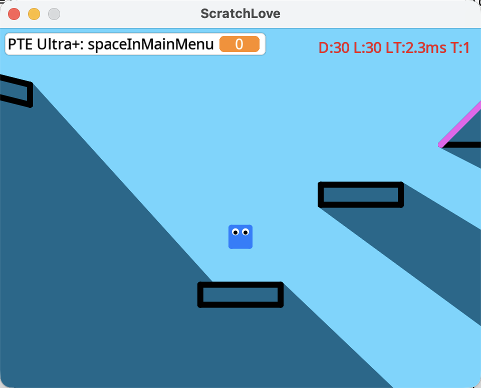
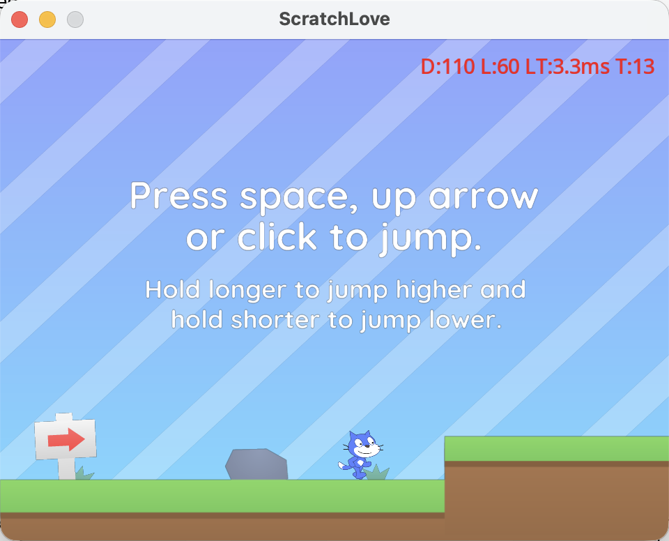
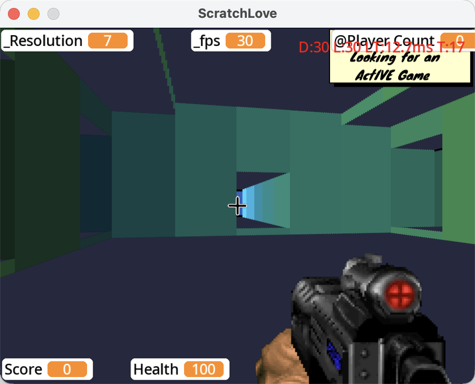
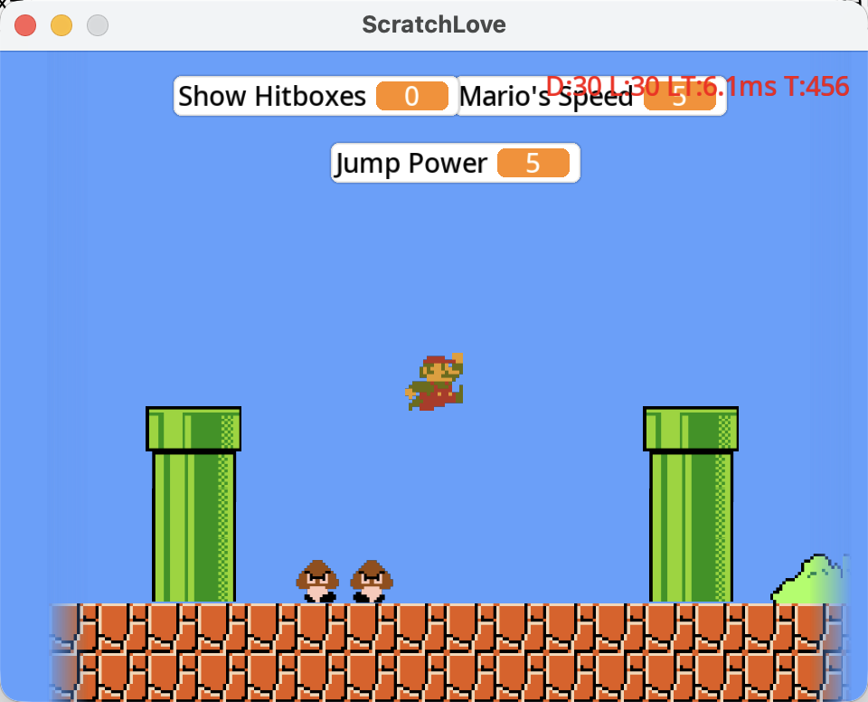
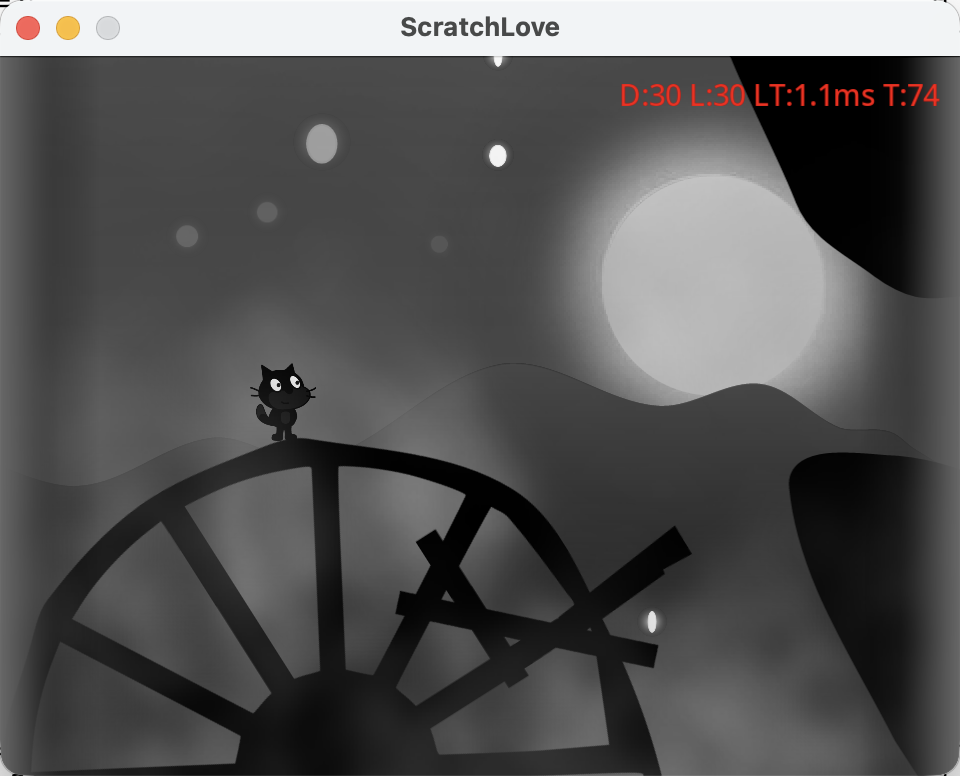
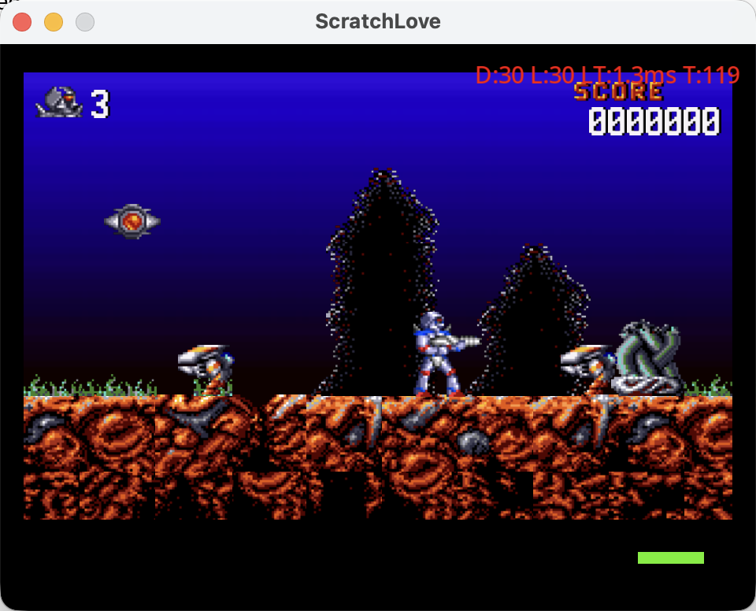

# ScratchLove

<div align="center">

[](https://love2d.org/) [](LICENSE) [](https://scratch.mit.edu/) [](https://discord.gg/d2zbWQkHnG)

**A native (browser-free) Scratch 3.0 runtime for LÖVE (Love2D)**

Join our [Discord community](https://discord.gg/d2zbWQkHnG) to discuss, share projects, and get help!

</div>

---

## Overview

ScratchLove is a native reimplementation of the [Scratch 3.0](https://scratch.mit.edu/) runtime in Lua for the [LÖVE](https://love2d.org/) framework. Created to break free from browser limitations, it delivers a superior native experience with access to hardware sensors, haptic feedback, and fine-grained performance control unconstrained by browser sandboxing. It supports a wide range of platforms (desktop, mobile) and devices including embedded Linux systems, gaming consoles, and handheld gaming devices.

### Games Running on ScratchLove

<div align="center">

| | | |
|:---:|:---:|:---:|
| <br/>**[Pen Platformer](https://scratch.mit.edu/projects/276932192/)** | <br/>**[Dash & Jump](https://scratch.mit.edu/projects/237272619/)** | <br/>**[3D Laser Tag](https://scratch.mit.edu/projects/17783489/)** |
| <br/>**[Super Mario Bros](https://scratch.mit.edu/projects/196684240/)** | <br/>**[Scratchnapped 2](https://scratch.mit.edu/projects/133622642/)** | <br/>**[Turrican II](https://scratch.mit.edu/projects/174671513/)** |

</div>

### Key Highlights

- 🎮 **Full Scratch Compatibility**: Nearly 100% compatible with Scratch 3.0 .sb3 format
- 📱 **Cross-Platform**: Powered by Love2D's cross-platform capabilities, supports desktop and mobile operating systems
- ⚡ **High Performance**: Scratch blocks compiled to native Lua code, powered by LuaJIT for near-native execution speed

---

## Features

### Compiler & Runtime

- **IR-Based Compiler**: Three-stage compilation (IR generation → optimization → Lua codegen)
- **Optimization Passes**: Constant folding, dead code elimination, control flow analysis
- **Cooperative Threading**: Efficient coroutine-based execution for concurrent scripts

### Graphics & Effects

- **Visual Effects**: Color, fisheye, whirl, pixelate, mosaic, brightness, ghost
- **SVG Rendering**: Native SVG support via resvg library
- **Collision Detection**: Color-based collision detection consistent with Scratch behavior

### Advanced Features

- **Project Options**: Compatible with TurboWarp project configuration (custom framerate, stage dimensions, runtime options like fencing, miscLimits, maxClones)
- **Online Loading**: Direct loading from scratch.mit.edu by project ID

---

## Known Limitations

- **Extensions**: Currently only the **Pen extension** is supported. Other Scratch extensions (Music, Text-to-Speech, Video Sensing, Translate, etc.) are not available as ScratchLove cannot run JavaScript-based extensions
- **User Input**: The "ask and wait" block is not yet supported (user input not implemented)
- **Microphone Input**: The loudness sensing block always returns 0 (microphone input not implemented)
- **Cloud Variables**: Only basic local storage is supported

---

## Quick Start

### Prerequisites

- **LÖVE (Love2D) 11.x**: [Download here](https://love2d.org/)
- **LuaJIT** (optional, for running tests): Included with LÖVE

### Installation

```bash
# Clone the repository
git clone https://github.com/fox2d-engine/ScratchLove.git
cd ScratchLove

# Run with a local .sb3 file
love . path/to/project.sb3

# Or run with a Scratch project ID (downloads from scratch.mit.edu)
love . 276932192

# Or drag & drop a .sb3 file into the window
```

### Running Tests

```bash
# Run all tests
luajit tests/run.lua

# Run specific test category
luajit tests/run.lua control
luajit tests/run.lua data
luajit tests/run.lua motion
```

### Porting to Other Platforms

ScratchLove leverages LÖVE's cross-platform capabilities, making it possible to distribute your Scratch projects to various platforms including Windows, macOS, Linux, Android, iOS, and handheld gaming devices.

To package and distribute ScratchLove for different platforms:

1. Follow the [LÖVE Game Distribution Guide](https://love2d.org/wiki/Game_Distribution) for platform-specific packaging instructions
2. Place your .sb3 project file at `assets/game.sb3` within the ScratchLove directory, then package everything into a .love archive
3. Build platform-specific executables or packages as needed

This enables you to turn Scratch projects into standalone native applications for virtually any platform that LÖVE supports.

---

## Architecture

### Project Structure

```
ScratchLove/
├── main.lua                    # Application entry point
├── conf.lua                    # LÖVE configuration
│
├── compiler/                   # Compilation pipeline
│   ├── irgen.lua               # IR generation from Scratch blocks
│   ├── iroptimizer.lua         # IR optimization passes
│   ├── luagen.lua              # Lua code generation from IR
│   └── blocks/                 # Block-specific IR generators
│
├── vm/                         # Virtual machine runtime
│   ├── runtime.lua             # Main runtime orchestration
│   ├── thread.lua              # Script execution threads
│   ├── sprite.lua              # Sprite objects
│   └── stage.lua               # Stage object
│
├── renderer/                   # Rendering system
│   ├── renderer.lua            # Main renderer
│   ├── shaders/                # GLSL shaders for visual effects
│   └── collision/              # Collision detection system
│
├── pen/                        # Pen drawing system
├── audio/                      # Audio system
├── loader/                     # Project loading
├── parser/                     # .sb3 parsing
├── ui/                         # User interface
├── utils/                      # Utility modules
├── resvg/                      # SVG rendering (FFI bindings)
├── tests/                      # Test suite
├── lib/                        # Third-party libraries
└── assets/                     # Fonts, gamepad mappings, etc.
```

---

## Development

### Development Setup

```bash
# Install dependencies
# Love2D should be installed system-wide

# Run in development mode
love .

# Run with debug logging
env LOG_LEVEL=debug love . project.sb3
```

### Debug Commands

```bash
# Skip compilation and use existing project.lua (for debugging compiled code)
env SKIP_COMPILE=1 love . project.sb3

# Run with timeout (useful for testing)
timeout --kill-after=3s 10s love . project.sb3
```

### Testing

```lua
-- Example test
local SB3Builder = require("tests.sb3_builder")

it("should execute motion blocks correctly", function()
    SB3Builder.resetCounter()
    local stage = SB3Builder.createStage()
    local sprite = SB3Builder.createSprite("TestSprite")

    local hatId, hatBlock = SB3Builder.Events.whenFlagClicked()
    local moveId, moveBlock = SB3Builder.Motion.moveSteps(10)

    SB3Builder.addBlock(sprite, hatId, hatBlock)
    SB3Builder.addBlock(sprite, moveId, moveBlock)
    SB3Builder.linkBlocks(sprite, {hatId, moveId})

    local projectJson = SB3Builder.createProject({stage, sprite})
    local project = ProjectModel:new(projectJson, {})
    local runtime = Runtime:new(project)
    runtime:initialize()
    runtime:broadcastGreenFlag()

    -- Execute with safety limits
    local maxIterations = 100
    local iterations = 0
    while #runtime:getActiveThreads() > 0 and iterations < maxIterations do
        runtime:update(1/60)
        iterations = iterations + 1
    end

    expect(runtime:getSpriteTargetByName("TestSprite").x).to.equal(10)
end)
```

### Code Quality Standards

- **Type Annotations**: All code uses LuaLS type annotations for IDE support
- **Testing**: New features must include test coverage
- **Documentation**: Functions should have clear docstrings
- **Code Style**: Follow existing Lua conventions in the codebase

---

## Contributing

We welcome contributions! Here's how you can help:

### Ways to Contribute

- 🐛 **Report bugs**: Open an issue with reproduction steps
- 💡 **Suggest features**: Share ideas for improvements
- 📝 **Improve docs**: Help clarify documentation
- 🧪 **Write tests**: Increase test coverage
- 🔧 **Fix issues**: Submit pull requests

### Development Workflow

1. Fork the repository
2. Create a feature branch (`git checkout -b feature/amazing-feature`)
3. Write tests for your changes
4. Implement your changes
5. Run the test suite (`luajit tests/run.lua`)
6. Commit with clear messages (`git commit -m 'Add amazing feature'`)
7. Push to your fork (`git push origin feature/amazing-feature`)
8. Open a Pull Request

### Commit Guidelines

- Use clear, descriptive commit messages
- Reference issues where applicable (`Fixes #123`)
- Keep commits atomic and focused
- Follow conventional commits format when possible

---

## License

**Copyright © 2025 [Fox2D.com](https://fox2d.com). All rights reserved.**

This project is licensed under the **GNU Affero General Public License v3.0 (AGPL-3.0)**

---

## Acknowledgments

### Special Thanks

We are deeply grateful to the **[TurboWarp](https://turbowarp.org/)** project and team. TurboWarp's innovative compiler architecture served as an invaluable reference during ScratchLove's development, helping us understand the nuances of Scratch VM behavior and optimization techniques. For running Scratch projects in the browser, we highly recommend using TurboWarp.

### Other Acknowledgments

- **[Scratch Team](https://scratch.mit.edu/)**: For creating an amazing platform that inspires creativity and learning
- **[LÖVE](https://love2d.org/)**: For the excellent Lua game framework
- All contributors and users who have helped improve this project
